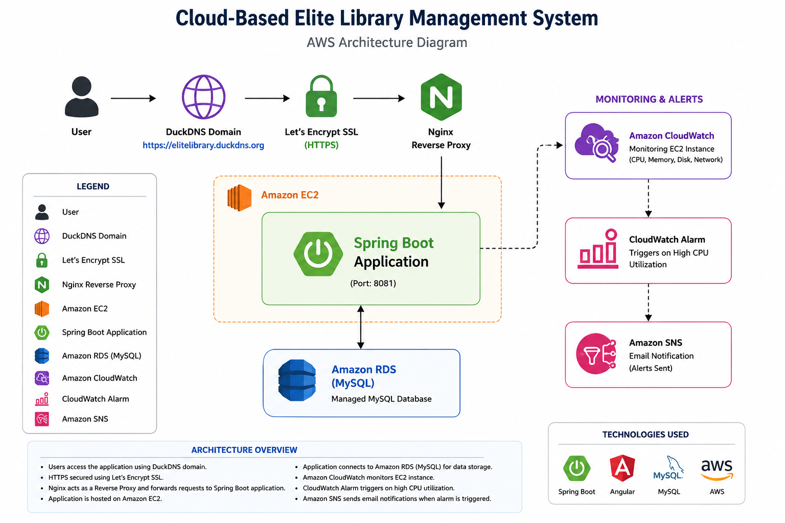

# 📚 Cloud-Based Elite Library Management System

A cloud-based Library Management System developed using **Spring Boot**, **Angular**, **MySQL**, and **AWS**.

---

## 🚀 Project Overview

This project is designed to manage a library digitally. It provides an easy way to manage students, seat bookings, and library administration through a modern web application.

The backend is developed using Spring Boot REST APIs, the frontend uses Angular, and the database is hosted on Amazon RDS. The application is deployed on AWS EC2.

---

## ✨ Features

* 📚 Student Registration & Management
* 🪑 Smart Seat Booking System
* 📊 Live Seat Availability Dashboard
* 👨‍💼 Admin Dashboard
* 🔍 Student Search by Name, Mobile, Seat Number & Student Code
* 💰 Revenue Dashboard
* 💳 Fee & Payment Management
* 🆔 Auto Student Code Generation
* 🌐 Responsive Angular Frontend
* ⚙️ Spring Boot REST APIs
* 🗄️ MySQL Database Integration
* ☁️ AWS EC2 Deployment
* 🛢️ Amazon RDS Integration
* 🌍 DuckDNS Public Domain
* 🔀 Nginx Reverse Proxy
* 📈 Amazon CloudWatch Monitoring
* 🚨 CloudWatch CPU Alarm
* 📧 Amazon SNS Email Notifications

---

## 🛠️ Tech Stack

### Frontend

* Angular
* HTML5
* CSS3
* TypeScript

### Backend

* Java 17
* Spring Boot
* Spring Data JPA
* REST APIs

### Database

* MySQL
* Amazon RDS

### Cloud & DevOps

* Amazon EC2
* Nginx Reverse Proxy
* Amazon CloudWatch
* CloudWatch Alarm
* Amazon SNS
* DuckDNS

### Tools

* Git
* GitHub
* Maven
* Postman
* VS Code
* IntelliJ IDEA

---

## 📂 Project Structure

```text
elite-library-management
│
├── backend/              # Spring Boot Backend
├── frontend/             # Angular Frontend
├── architecture/         # AWS Architecture Diagram
├── screenshots/          # Project Screenshots
└── README.md
```
## 🔗 API Endpoints

| Method | Endpoint           | Purpose              |
| ------ | ------------------ | -------------------- |
| GET    | /api/dashboard     | Dashboard Statistics |
| GET    | /api/students      | Get All Students     |
| POST   | /api/students      | Register Student     |
| DELETE | /api/students/{id} | Delete Student       |
| GET    | /api/seats         | Get Seat Status      |
| POST   | /api/seats/book    | Book Seat            |

## 🚀 Installation Guide

### 1. Clone the Repository

```bash
git clone https://github.com/prashantpatil4619/elite-library-management.git
cd elite-library-management
```

### 2. Backend Setup

```bash
cd backend
mvn clean package
java -jar target/library-management-0.0.1-SNAPSHOT.jar
```

### 3. Frontend Setup

```bash
cd frontend
npm install
ng build
```

### 4. Deploy Angular Build

Copy the generated files from:

```text
dist/elite-library/browser
```

to the Nginx web root:

```text
/usr/share/nginx/html
```

### 5. Start Nginx

```bash
sudo systemctl restart nginx
```

### 6. Local Development

**Frontend**

```text
http://localhost:4200
```

**Backend**

```text
http://localhost:8081
```

### 7. Production Deployment

* Spring Boot runs as a **systemd service** on Amazon EC2.
* Angular is deployed as **static files** and served by **Nginx**.
* HTTPS is enabled using **Let's Encrypt SSL**.
* Public access is provided through **DuckDNS**.

### 🌐 Live URL

https://elitelibrary.duckdns.org

```
## 🏗️ Project Architecture



This architecture illustrates the deployment of the Elite Library Management System on AWS using Amazon EC2, Amazon RDS, Nginx Reverse Proxy, DuckDNS, Let's Encrypt SSL, Amazon CloudWatch, CloudWatch Alarm, and Amazon SNS.

## ☁️ AWS Services Used

* Amazon EC2 – Hosted the Spring Boot Backend
* Amazon RDS – Managed MySQL Database
* Amazon CloudWatch – Monitoring EC2 Instance
* CloudWatch Alarm – CPU Utilization Alerts
* Amazon SNS – Email Notifications
* Nginx – Reverse Proxy
* DuckDNS – Public Domain
* AWS Security Groups – Network Security
* Let's Encrypt SSL – Secure HTTPS Communication

## 🚀 Deployment Highlights

* Spring Boot backend deployed on **Amazon EC2**.
* Configured the backend as a **systemd service** for automatic startup after EC2 reboot.
* Angular application built using **production build (`ng build`)** and deployed as static files using **Nginx**.
* Configured **Nginx Reverse Proxy** to route frontend traffic and backend API requests.
* Secured the application using **Let's Encrypt SSL (HTTPS)**.
* Configured **DuckDNS** for public domain access.
* Hosted the MySQL database on **Amazon RDS**.
* Configured **Amazon CloudWatch** for EC2 monitoring.
* Created **CloudWatch CPU Alarms**.
* Configured **Amazon SNS** email notifications for alerts.
* Applied **AWS Security Groups** for secure inbound traffic.


## 🔮 Future Enhancements

* QR Code Attendance System
* Online Payment Gateway
* Student Login Portal
* Email Notifications
* Fine Management
* Reports & Analytics Dashboard
* Docker Containerization
* CI/CD Pipeline using GitHub Actions


## 📸 Project Screenshots

### 🏠 Home Page


---

### 🪑 Seat Booking Page


---

### 📊 Live Seat Status


---

### 👨‍💼 Admin Dashboard


---

### 👨‍🎓 Student List


## 👨‍💻 Author

**Prashant Patil**

GitHub:
https://github.com/prashantpatil4619

Project Repository:
https://github.com/prashantpatil4619/elite-library-management
