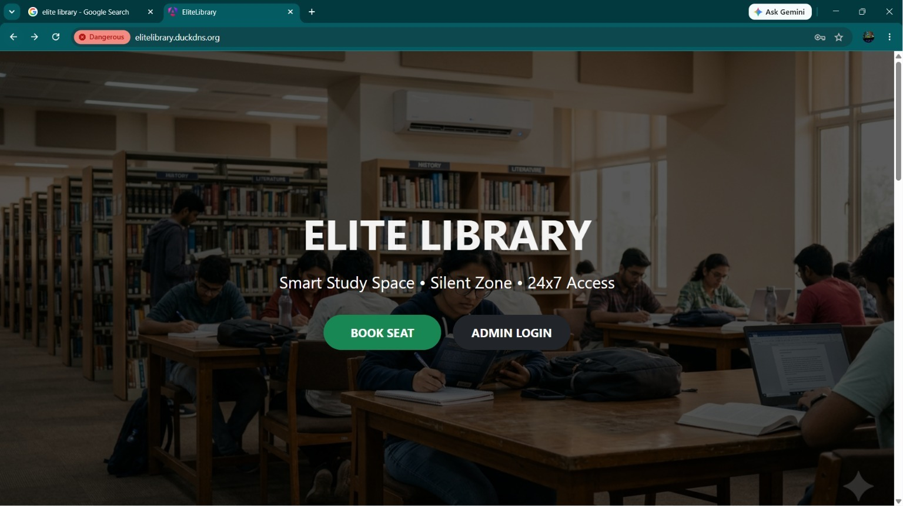
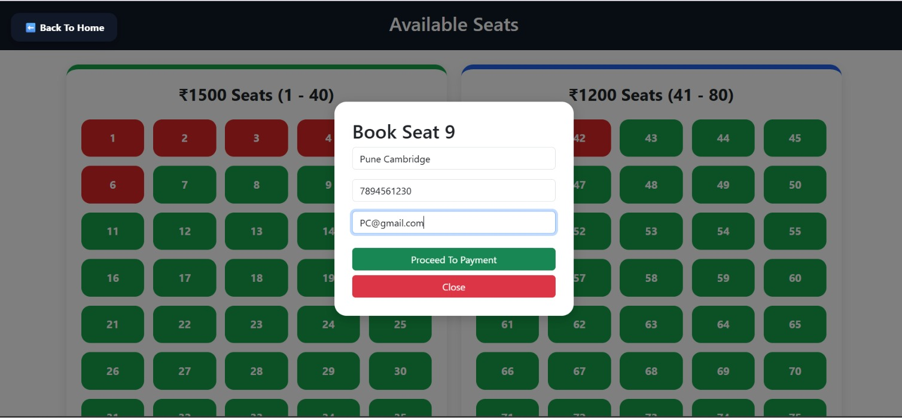
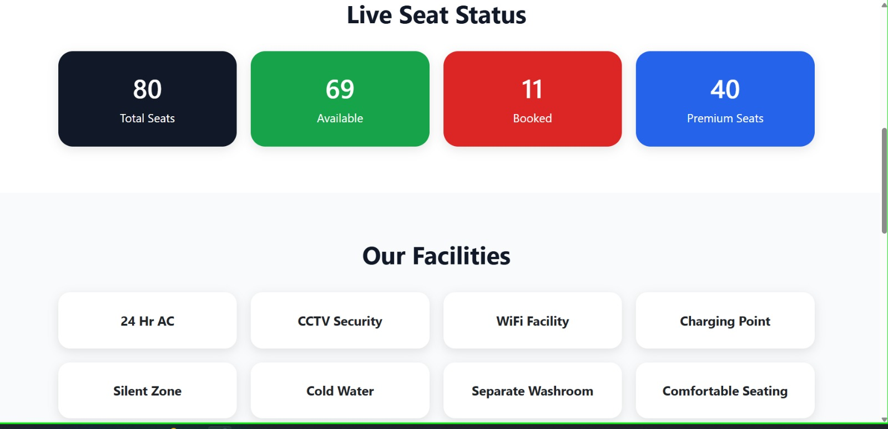
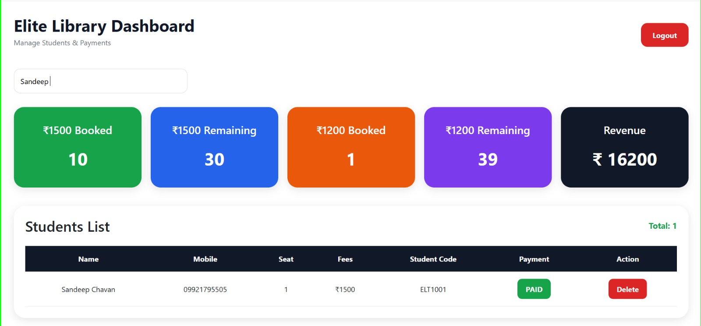
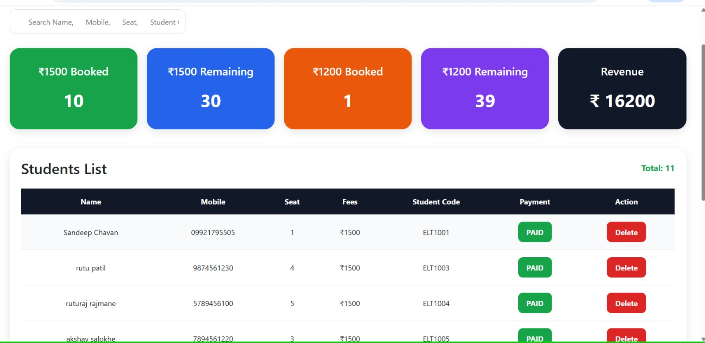

# 📚 Elite Library Management System

A cloud-based Library Management System developed using **Spring Boot**, **Angular**, **MySQL**, and **AWS**.

---

## 🚀 Project Overview

This project is designed to manage a library digitally. It provides an easy way to manage students, seat bookings, and library administration through a modern web application.

The backend is developed using Spring Boot REST APIs, the frontend uses Angular, and the database is hosted on Amazon RDS. The application is deployed on AWS EC2.

---

## ✨ Features

* 📚 Student Registration & Management
* 🪑 Smart Seat Booking System
* 📊 Live Seat Availability Dashboard
* 👨‍💼 Admin Dashboard
* 🔍 Student Search by Name, Mobile, Seat Number & Student Code
* 💰 Revenue Dashboard
* 💳 Fee & Payment Management
* 🆔 Auto Student Code Generation
* 🌐 Responsive Angular Frontend
* ⚙️ Spring Boot REST APIs
* 🗄️ MySQL Database Integration
* ☁️ AWS EC2 Deployment
* 🛢️ Amazon RDS Integration
* 🌍 DuckDNS Public Domain
* 🔀 Nginx Reverse Proxy
* 📈 Amazon CloudWatch Monitoring
* 🚨 CloudWatch CPU Alarm
* 📧 Amazon SNS Email Notifications

---

## 🛠 Tech Stack

### Frontend
- Angular
- TypeScript
- HTML
- CSS

### Backend
- Java
- Spring Boot
- Spring Data JPA
- REST API

### Database
- MySQL
- Amazon RDS

### Cloud
- AWS EC2
- Amazon RDS

---

## 🏗️ Project Architecture

```text
                 User
                   │
                   ▼
          DuckDNS Domain
                   │
                   ▼
        Nginx Reverse Proxy
                   │
                   ▼
 Spring Boot Backend (AWS EC2)
                   │
                   ▼
        Amazon RDS (MySQL)

Monitoring

CloudWatch
      │
      ▼
CloudWatch Alarm
      │
      ▼
Amazon SNS Email Notification
```


---

## ⚙️ Installation

### Backend

```bash
cd backend
mvn spring-boot:run
```

### Frontend

```bash
cd frontend
npm install
ng serve
```

---


## ☁️ AWS Services Used

* Amazon EC2 – Hosted the Spring Boot Backend
* Amazon RDS – Managed MySQL Database
* Amazon CloudWatch – Monitoring EC2 Instance
* CloudWatch Alarm – CPU Utilization Alerts
* Amazon SNS – Email Notifications
* Nginx – Reverse Proxy
* DuckDNS – Public Domain
* AWS Security Groups – Network Security


## 🔮 Future Enhancements

- Email Notifications
- QR Code Based Entry
- Online Payment
- Fine Management
- Attendance Reports

---

## 👨‍💻 Author

**Prashant Patil**

GitHub:
---

## 📸 Project Screenshots

### 🏠 Home Page



---

### 🪑 Seat Booking Page



---

### 📊 Live Seat Status



---

### 👨‍💼 Admin Dashboard



---

### 👨‍🎓 Student List


